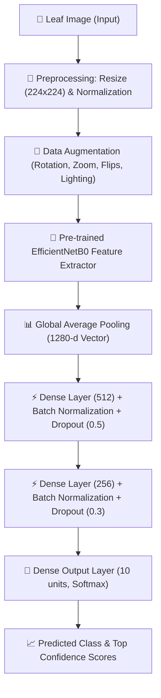

# 🍅 How Tomato Disease Detection Works

A comprehensive technical and architectural guide to the Deep Learning Tomato Leaf Disease Classification System.

---

## 📑 Table of Contents
1. [Overview](#1-overview)
2. [End-to-End System Pipeline](#2-end-to-end-system-pipeline)
3. [Dataset & Classes](#3-dataset--classes)
4. [Data Preprocessing & Augmentation](#4-data-preprocessing--augmentation)
5. [Deep Learning Architecture](#5-deep-learning-architecture)
6. [Two-Stage Training Workflow](#6-two-stage-training-workflow)
7. [Inference Engine (predict.py)](#7-inference-engine-predictpy)
8. [Local Execution & System Setup](#8-local-execution--system-setup)
9. [Evaluation Metrics & Artifacts](#9-evaluation-metrics--artifacts)

---

## 1. Overview

Tomato crops are vulnerable to numerous fungal, bacterial, and viral infections that can devastate agricultural yields. Early and accurate detection allows farmers to take targeted treatment actions before infection spreads.

This project implements an end-to-end **Computer Vision Deep Learning Model** capable of identifying **9 distinct tomato plant diseases** plus **healthy leaves** from digital photographs with **98%+ accuracy**.

---

## 2. End-to-End System Pipeline



---

## 3. Dataset & Classes

The system trains on **15,139 curated tomato leaf images** divided into 10 classes:

| Class ID | Disease Name | Pathogen / Type | Visual Symptoms |
|:---:|:---|:---|:---|
| **0** | `Tomato___Bacterial_spot` | Bacteria (*Xanthomonas*) | Small, water-soaked brown spots with yellow chlorotic halos. |
| **1** | `Tomato___Early_blight` | Fungus (*Alternaria solani*) | Concentric "target-board" dark rings with yellow surrounding tissue. |
| **2** | `Tomato___Late_blight` | Oomycete (*Phytophthora infestans*) | Large, irregular water-soaked pale-to-dark brown rotting lesions. |
| **3** | `Tomato___Leaf_Mold` | Fungus (*Passalora fulva*) | Pale green/yellow spots on top surface; olive velvety mold underneath. |
| **4** | `Tomato___Septoria_leaf_spot` | Fungus (*Septoria lycopersici*) | Dense, circular spots with grayish-white centers and dark margins. |
| **5** | `Tomato___Spider_mites...` | Pest (*Tetranychus urticae*) | Fine yellow stippling/speckling, bronzing, and delicate webbing. |
| **6** | `Tomato___Target_Spot` | Fungus (*Corynespora cassiicola*) | Pinpoint dark spots enlarging into brown lesions with concentric rings. |
| **7** | `Tomato___Tomato_Yellow_Leaf_Curl_Virus` | Virus (Begomovirus) | Severe upward leaf curling, yellowed margins, and bushy stunting. |
| **8** | `Tomato___Tomato_mosaic_virus` | Virus (Tobamovirus) | Mottled light and dark green mosaic patterns, distorted/strapped leaves. |
| **9** | `Tomato___healthy` | Healthy Tissue | Vibrant, uniform green color, clear veins, and no necrotic lesions. |

### Dataset Partitioning:
- **Training Set (70% ~ 10,592 images):** Optimizes model weights via backpropagation.
- **Validation Set (20% ~ 3,008 images):** Evaluates generalization after every epoch to guide early stopping and learning rate scheduling.
- **Test Set (10% ~ 1,568 images):** Held out for unbiased final performance testing.

---

## 4. Data Preprocessing & Augmentation

Raw photos come in varied resolutions, lighting conditions, and camera angles. To ensure robust real-world generalization:

1. **Resolution Standardization:** Images are loaded and uniformly resized to `224 × 224 × 3` (RGB).
2. **Dynamic Augmentation Layer (`tf.keras.Sequential`):**
   - **RandomFlip:** Horizontal & vertical flipping to handle leaf orientations.
   - **RandomRotation (±30%):** Invariant to tilt angles.
   - **RandomZoom (±20%):** Invariant to camera distances.
   - **RandomContrast & RandomBrightness (±20%):** Handles outdoor sun versus shadow conditions.
3. **RAM In-Memory Caching (`dataset.cache()`):** Decoded tensors are cached into memory after Epoch 1, accelerating subsequent epochs by over 50%.

---

## 5. Deep Learning Architecture

The model utilizes **Transfer Learning** built upon Google's **EfficientNetB0**.

### Why EfficientNetB0?
Rather than training a Convolutional Neural Network (CNN) from zero, EfficientNetB0 was pre-trained on the ImageNet dataset (1.4 million images). It has already mastered low-level computer vision features (edges, corners, leaf textures, color gradients), allowing our model to focus on differentiating plant diseases with minimal training time.

### Layer Specifications:

| Layer | Type | Output Shape | Parameters | Purpose |
|:---|:---|:---|:---|:---|
| **Input** | `InputLayer` | `(None, 224, 224, 3)` | 0 | Raw RGB leaf image |
| **Base Model** | `EfficientNetB0` | `(None, 7, 7, 1280)` | 4,049,571 | Deep feature extraction |
| **Pooling** | `GlobalAveragePooling2D` | `(None, 1280)` | 0 | Reduces spatial map to 1D vector |
| **Dense 1** | `Dense (ReLU)` | `(None, 512)` | 655,872 | High-level disease feature learning |
| **BatchNorm 1**| `BatchNormalization` | `(None, 512)` | 2,048 | Normalizes activations for stability |
| **Dropout 1** | `Dropout (0.5)` | `(None, 512)` | 0 | Prevents co-adaptation / overfitting |
| **Dense 2** | `Dense (ReLU)` | `(None, 256)` | 131,328 | Refines classification boundaries |
| **BatchNorm 2**| `BatchNormalization` | `(None, 256)` | 1,024 | Accelerates gradient flow |
| **Dropout 2** | `Dropout (0.3)` | `(None, 256)` | 0 | Regularization |
| **Output** | `Dense (Softmax)` | `(None, 10)` | 2,570 | Probability distribution over 10 classes |

- **Total Parameters:** 4,842,413 (~18.5 MB)
- **Trainable (Stage 1):** 791,306 (~3.0 MB)

---

## 6. Two-Stage Training Workflow

To maximize test accuracy while preventing catastrophic forgetting of ImageNet weights:

```
[ Stage 1: Feature Extraction ]
- EfficientNet base is FROZEN (trainable = False)
- Only the custom Dense head trains (791k params)
- Learning Rate: 0.001 (Adam optimizer)
- Goal: Establish strong disease classification weights without disturbing pre-trained filters

               │
               ▼  (Validation accuracy plateaus)

[ Stage 2: Fine-Tuning ]
- Top 50% of EfficientNet layers are UNFROZEN
- Lower layers remain frozen to preserve edge/texture filters
- Learning Rate: 0.0001 (10x smaller to prevent destructive updates)
- Goal: Adapt deep convolutional filters specifically to leaf pathology
```

### Callbacks & Regularization:
- **EarlyStopping:** Stops training if validation loss fails to improve for 5 consecutive epochs, restoring the best weights.
- **ReduceLROnPlateau:** Cuts learning rate in half (`factor=0.5`) when validation loss plateaus for 3 epochs.
- **ModelCheckpoint:** Saves the best performing model (`tomato_disease_{epoch}_{val_acc}.h5`) whenever a new validation accuracy record is set.
- **Class Weights:** Automatically computes inverse-frequency weights to ensure rare classes (e.g. Mosaic Virus) receive equal gradient impact as abundant classes.

---

## 7. Inference Engine (`predict.py`)

When evaluating a test image:

```powershell
.\run_predict.bat "Images/Tomato Leaf Image having Late blight.png"
```

1. **Loads Model & Metadata:** Loads `models/tomato_disease_final.h5` and `models/class_names.json`.
2. **Forward Inference:** Passes the resized image array through the model.
3. **Probability Normalization:** The Softmax layer outputs 10 values summing to 1.0 (100%).
4. **Ranked Output:** Sorts predictions to output:
   - Primary predicted disease
   - Confidence percentage
   - Top 3 ranked candidates
   - Automatic low-confidence warning if highest score < 70%.

---

## 8. Local Execution & System Setup

To bypass Windows 11 Smart App Control (SAC) restrictions that block unsigned third-party Python C++ binaries, this project utilizes **WSL2 (Windows Subsystem for Linux)** while providing native one-click Windows wrappers:

| Command | File | Description |
|:---|:---|:---|
| `.\run_train.bat` | [`run_train.bat`](run_train.bat) | Starts full two-stage training in WSL environment. |
| `.\run_predict.bat <img_path>` | [`run_predict.bat`](run_predict.bat) | Runs instant disease prediction on an image. |
| `bash run_train.sh` | [`run_train.sh`](run_train.sh) | Direct Linux/WSL shell execution for training. |
| `bash run_predict.sh <img_path>` | [`run_predict.sh`](run_predict.sh) | Direct Linux/WSL shell execution for inference. |

---

## 9. Evaluation Metrics & Artifacts

All training artifacts are exported to `models/` and `outputs/`:

- **Exported Models:**
  - `models/tomato_disease_final.h5`: Full Keras model.
  - `models/tomato_disease_saved_model/`: TensorFlow SavedModel format for web/production serving.
  - `models/tomato_disease.tflite`: Quantized lightweight model for Android, iOS, and Raspberry Pi.
- **Evaluation Plots:**
  - `outputs/training_history.png`: Accuracy/Loss progression and Overfitting Gap.
  - `outputs/confusion_matrix.png`: Per-class confusion heatmap showing exact correct/misclassified counts.
  - `outputs/roc_curves.png`: Receiver Operating Characteristic curves and AUC scores per disease.
  - `outputs/classification_metrics.csv`: Precision, Recall, F1-Score, and Support breakdown.
