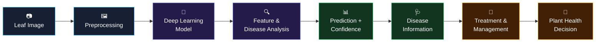
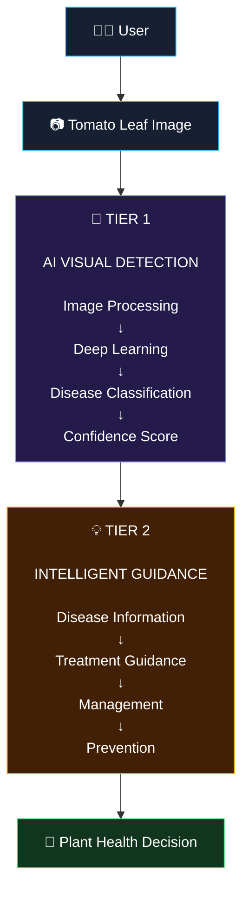

# 🍅 Tomato Disease Detection AI

<div align="center">

### 🌱 Intelligent Tomato Leaf Disease Detection Using AI

**Computer Vision · Deep Learning · Image Classification · Intelligent Diagnosis**

<br/>


</div>

---

## 🧠 What Is This?

**Tomato Disease Detection AI** is an AI-powered computer vision system designed to analyze tomato leaf images and identify potential plant diseases.

The system takes a tomato leaf image as input, processes the visual information, analyzes disease-related patterns using a trained deep learning model, and presents the result with a **prediction, confidence level, and disease-specific management guidance**.

The goal is simple:

> 🍅 **Turn a leaf image into an understandable plant-health decision.**

Instead of requiring users to manually identify symptoms, the system provides an AI-assisted analysis through an interactive dashboard.

---

# 🚀 The Intelligent Detection Pipeline

The system follows a structured **image → AI → diagnosis → guidance** workflow.



---

# 🔬 How the System Works

### 01 — 📷 Image Acquisition

The user uploads or selects a tomato leaf image through the dashboard.

The image becomes the input for the AI inference pipeline.

```text
Leaf Image
     ↓
Input Validation
     ↓
AI Processing
```

---

### 02 — 🖼️ Image Preprocessing

Before inference, the image is prepared for the model.

Typical preprocessing operations include:

- Image resizing
- Pixel normalization
- Tensor conversion
- Input-shape preparation
- Model-compatible formatting

```text
Raw Image
    ↓
Resize
    ↓
Normalize
    ↓
Tensor
    ↓
Model Input
```

---

### 03 — 🧠 Deep Learning Inference

The processed image is passed into the trained deep learning model.

The model analyzes visual characteristics such as:

- Leaf texture
- Color patterns
- Spots
- Lesions
- Discoloration
- Structural abnormalities
- Disease-specific visual patterns

The model then produces class predictions.

---

### 04 — 🔍 Disease Analysis

The prediction output is interpreted to determine the most probable disease class.

Conceptually:

```text
Image
  ↓
Visual Features
  ↓
Learned Patterns
  ↓
Disease Classes
  ↓
Probability Scores
```

The system uses the model's prediction scores to determine the displayed diagnosis.

---

### 05 — 📊 Prediction & Confidence

The dashboard presents the AI result in an understandable format.

Example:

```text
┌─────────────────────────────────┐
│        AI DIAGNOSIS             │
│                                 │
│  Disease: Early Blight         │
│                                 │
│  Confidence: 94.7%              │
│  ███████████████████░           │
│                                 │
│  Status: ⚠️ Potential Disease   │
└─────────────────────────────────┘
```

The confidence value should be interpreted as the **model's confidence in its prediction**, not as a guarantee that the diagnosis is correct.

---

# 💊 Intelligent Treatment & Management

After identifying the predicted disease, the application connects the result with relevant disease information.

The user can receive:

### 🩺 Disease Information
What the detected disease represents.

### 🔍 Common Symptoms
Visual symptoms associated with the disease.

### 💊 Treatment Guidance
General management and treatment information.

### 🌱 Prevention
Steps that may help reduce future disease occurrence.

### ⚠️ Management Recommendations
Practical actions relevant to maintaining plant health.

This creates a complete user journey:

```text
Detect
  ↓
Understand
  ↓
Manage
  ↓
Protect
```

---

# 🏗️ Two-Tier Intelligent Architecture

The key idea behind the system is separating **visual intelligence** from **decision-support information**.



### 🧠 Tier 1 — Visual Intelligence

Responsible for answering:

> **"What disease does this image most closely match?"**

```text
Image
 ↓
Preprocessing
 ↓
Deep Learning
 ↓
Classification
 ↓
Prediction
 ↓
Confidence
```

### 💡 Tier 2 — Decision Support

Responsible for answering:

> **"What does this result mean and what management information is relevant?"**

```text
Prediction
 ↓
Disease Information
 ↓
Treatment
 ↓
Management
 ↓
Prevention
```

This separation makes the system easier to understand, maintain, and extend.

---

# ✨ Key Features

| Feature | Description |
|---|---|
| 📷 Image Upload | Upload tomato leaf images for analysis |
| 🧠 AI Classification | Deep learning-based disease classification |
| 🔍 Visual Analysis | Analyze disease-related visual patterns |
| 📊 Confidence Score | Display model prediction confidence |
| 🩺 Disease Information | Explain the detected condition |
| 💊 Treatment Guidance | Provide relevant management information |
| 🌱 Prevention Guidance | Help users understand preventive practices |
| ⚡ Interactive Dashboard | Simple interface for AI analysis |
| 📱 User-Friendly Results | Convert technical predictions into understandable results |

---

# 🧪 AI Pipeline

```text
                 TOMATO LEAF IMAGE
                         │
                         ▼
              ┌────────────────────┐
              │ Image Preprocessing│
              └─────────┬──────────┘
                        │
                        ▼
              ┌────────────────────┐
              │ Deep Learning Model│
              └─────────┬──────────┘
                        │
                        ▼
              ┌────────────────────┐
              │ Disease Prediction │
              └─────────┬──────────┘
                        │
                ┌───────┴────────┐
                ▼                ▼
          Prediction        Confidence
                │                │
                └───────┬────────┘
                        ▼
               ┌─────────────────┐
               │ AI Result Layer │
               └────────┬────────┘
                        │
                        ▼
               ┌─────────────────┐
               │ Treatment &     │
               │ Management      │
               └────────┬────────┘
                        │
                        ▼
                 🌱 FINAL RESULT
```

---

# 🛠️ Technology Stack

### 🤖 Artificial Intelligence

- Deep Learning
- Machine Learning
- Computer Vision
- Image Classification
- Image Processing

### 🌿 Application Layer

- Interactive web dashboard
- Image upload pipeline
- AI inference integration
- Prediction visualization
- Treatment / management information layer

### 🗄️ Data & Model Layer

- Image datasets
- Disease classes
- Model predictions
- Confidence scores
- Disease information mapping

---

# 🎯 Project Objective

The primary objective is to make tomato disease identification:

**Faster · More Accessible · AI-Assisted · Understandable**

Traditional disease identification can require users to manually inspect symptoms or consult an expert.

This project explores how **computer vision and deep learning** can assist with the first stage of that process by analyzing leaf images and presenting an understandable result.

---

# 🌱 Why This Project Matters

Agriculture increasingly benefits from digital tools that can help users identify problems earlier.

A system like this can act as an **AI-assisted first layer of plant-health analysis**.

```text
                🍅 FARM / PLANT
                       │
                       ▼
                📷 Leaf Image
                       │
                       ▼
                 🤖 AI System
                       │
          ┌────────────┴────────────┐
          ▼                         ▼
     🔍 Detection              📊 Confidence
          │                         │
          └────────────┬────────────┘
                       ▼
                 💡 Guidance
                       │
                       ▼
                 🌱 Management
```

The system is intended as an **AI-assisted decision-support tool**, not a replacement for professional agricultural diagnosis.

---

# 🔮 Future Improvements

The architecture can be extended beyond basic classification.

### 🤖 Advanced AI

- Explainable AI / Grad-CAM visualization
- More disease classes
- Better model calibration
- Ensemble models
- Image-quality validation
- Confidence thresholds

### 📷 Computer Vision

- Leaf segmentation
- Disease-region localization
- Lesion detection
- Severity estimation
- Multiple-leaf analysis

### 🌱 Agriculture Intelligence

- Crop-specific recommendations
- Weather-aware recommendations
- Regional disease information
- Growth-stage analysis
- Historical plant-health tracking

### ☁️ Production

- Cloud model serving
- Scalable inference API
- Model monitoring
- Prediction logging
- Continuous model improvement

---

# 📌 Example User Journey

```text
👨‍🌾 USER
   │
   │ Uploads leaf image
   ▼
📷 IMAGE
   │
   ▼
🖼️ PREPROCESSING
   │
   ▼
🧠 AI MODEL
   │
   ▼
🔍 DISEASE ANALYSIS
   │
   ▼
📊 PREDICTION
   │
   ├── Disease
   └── Confidence
   │
   ▼
💊 MANAGEMENT GUIDANCE
   │
   ▼
🌱 INFORMED PLANT-HEALTH DECISION
```

---

# 🏆 Project Vision

> **Build an intelligent agricultural assistant that can transform a simple leaf photograph into useful, understandable plant-health information.**

The long-term vision is to evolve the system from simple **disease classification** into a broader **AI-powered plant health platform**.

---

<div align="center">

## 🍅 Upload. Analyze. Understand. Protect. Grow. 🌱

<br/>

**Built with 🤖 AI + 🧠 Deep Learning + 🌿 Computer Vision**

</div>
